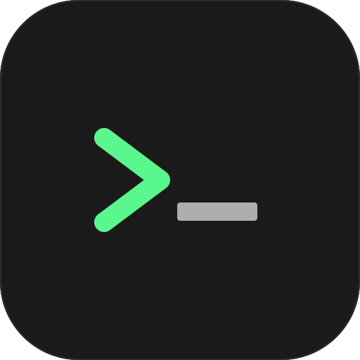

# term



A personal Mac terminal emulator built for terminal-based AI work. Written in Rust, GPU-accelerated via Metal, with just enough features to get the job done and nothing more.

## Build

```sh
cargo build --release
cargo run --release
```

Builds three binaries: `term`, `tcat`, and `tdiff`. No external tools or scripts needed.

## Features

- **GPU-accelerated rendering** — Metal-backed framebuffer via softbuffer
- **Catppuccin Mocha** color theme throughout
- **True-color support** — ANSI 8/16, 256-color, and 24-bit RGB
- **Syntax-highlighted `cat`** — `cat` is aliased to `tcat`, which highlights files using `syntect`
- **Syntax-highlighted diffs** — `tdiff` is set as `GIT_PAGER`, so `git diff`, `git show`, and `git log -p` all render with color
- **Blinking cursor** — narrow vertical bar, blinks at ~530 ms, resets on input
- **zsh** with your real `~/.zshrc` and `~/.zshenv` sourced automatically
- **Standard VT/ANSI sequences** — cursor movement, erase, scroll regions, insert/delete chars, cursor save/restore
